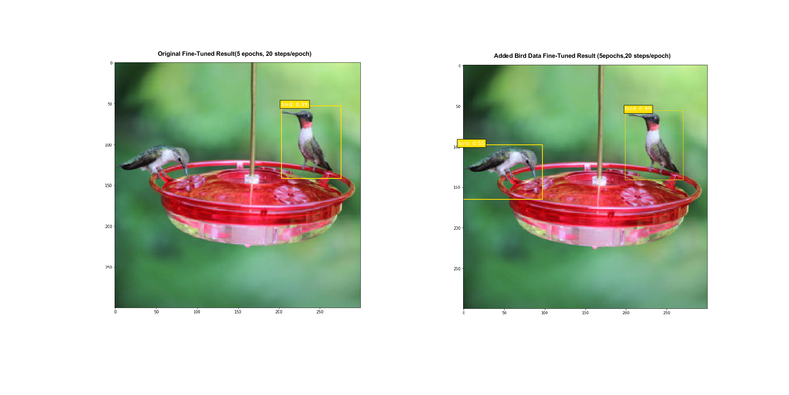
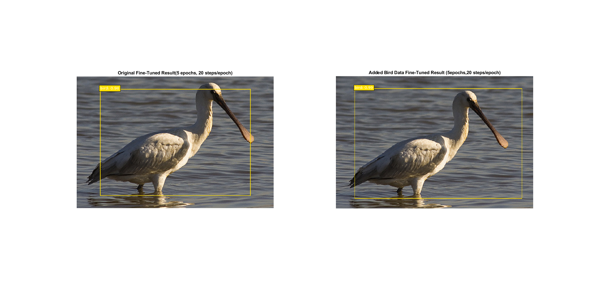
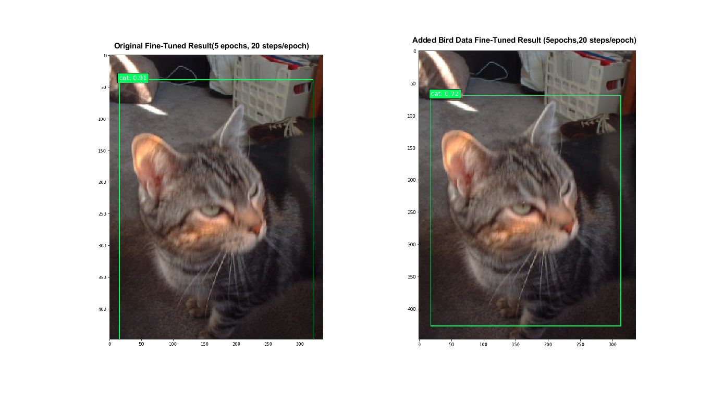

Description
===========
This is the ECE285 Project: Multi-Object Detection Using Deep Learning by team CKYS
Team members: Haili Cai, Joseph Kadifa, Jeffrey Yeung, Isha Srivastava.
Main SSD codes are from https://github.com/pierluigiferrari/ssd_keras. Different modifications and experiments are done on this structure. 

Required Packets
===============
* Tensorflow or Tensorflow-gpu 1.x
* Keras 2.x
* OpenCV
* Python3.x
* Numpy
* Beautiful Soup 4.x

All can be installed using Anaconda

Code Organization:
=================
1. Run Project_Demo.ipynb for fast visualizing the prediction difference when fine-tunning with more birds data.
2. Run different modifications of interest following the descriptions in the report.
3. All the folders except the modification folders contain items that were needed to run and train the models
4. The Modification csv files store the results of our modifications
5. The Modification ipynb files store how we generated the modifications.

Results From Demo:
=================
* For bird class, fine-tuned with birds data yields better result. However, for other classes, the result may vary. See the report session 4.1 for detail comparison. Please click on the image for better resolution

