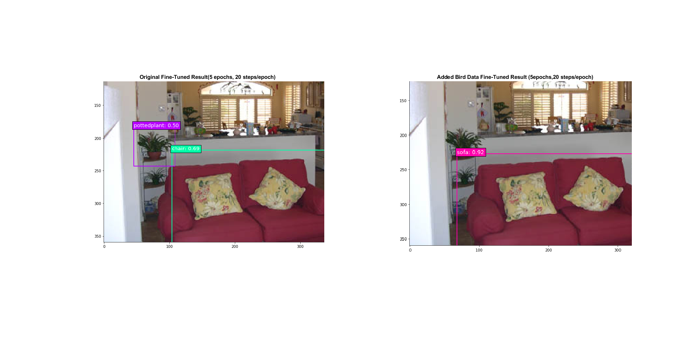

Description
===========
This is the ECE285 Project: Multi-Object Detection Using Deep Learning by team CKYS
Team members: Haili Cai, Joseph Kadifa, Jeffrey Yeung, Isha Srivastava.
Main SSD codes are from https://github.com/pierluigiferrari/ssd_keras. Different modifications and experiments are done on this structure. 

Required Packets
===============
* Tensorflow or Tensorflow-gpu 1.x
* Keras 2.x
* OpenCV
* Python3.x
* Numpy
* Beautiful Soup 4.x

All can be installed using Anaconda

Code Organization:
=================
1. Run Demo.ipynb for fast visualizing the prediction difference when fine-tunning with more birds data.
2. Run different modification of interest following the descriptions in the report.

Results From Demo:
=================
* In bird class, fine-tuned with birds data yields better result. However, for other classes, the result may vary. See the report session 4.1 for detail comparison. 

